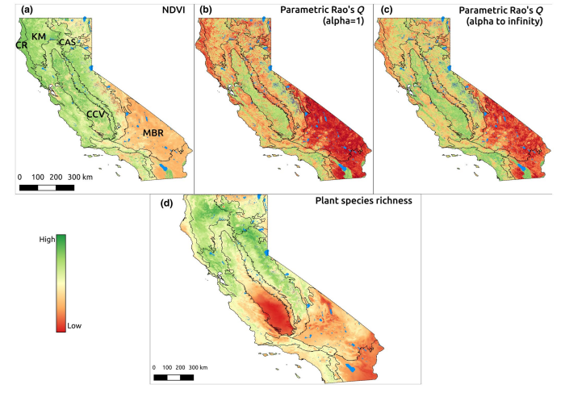
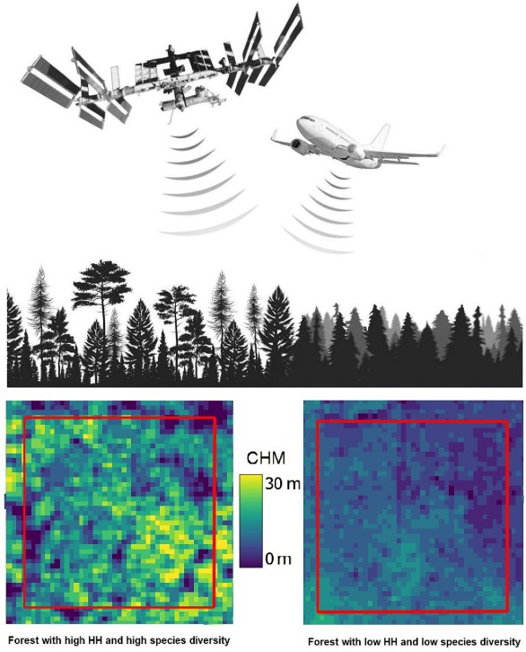

# Spatio-Temporal Parametric Rao's Q - a Species Diversity Proxy using Earth Observation Data

## Introduction
A GEE JS API implementation of the spatio-parametric Rao's Quadratic Entropy (Rao's Q).

## Features
Rao's Q is a measure of landscape diversity. It calculates inter-pixel spectral distances,
which are directly related to landscape heterogeneity, a proxy for describing species habitats (Rocchini et al., 2005).

The approach is most adequately applied to (semi-)natural landscapes with low levels of fragmentation.
In other words, it performs poorly over highly-fragmented agricultural landscapes, and well over closed-canopy forest, woodlands and rangelands.

### NDVI use-case

Spectral indices such as NDVI may be used as input to computing the Rao's Q, in which case an accurate land cover product must be used
to mask out areas of low vegetation cover. The computation of the Rao's Q has the tendency to inflate the diversity score around
land cover boundaries (e.g. forest edges), hence the importance of masking out these locations.

Rao's Q example applied to NDVI data for California:


(Taken from [Rocchini et al., 2021](https://onlinelibrary.wiley.com/doi/10.1111/geb.13270))

Since the Rao's Q based on NDVI can be derived from satellite time series such as Sentinel-2 and Planetscope (NICFI basemaps), 
we can also look at the behavior of Rao's Q over time by computing the coefficient of variation (CV) and slope of change (trend),
to understand the behavior of Rao's Q over time. The code link in the `Examples` section below provides an example of how to compute the temporal Rao's Q metrics.

### Canopy Height use-case

Rao's Q can take as input a canopy height model in the case of forest diversity monitoring. In such a case,
Rao's Q represents the canopy height heterogeneity, which is a robust proxy of plant diversity in closed-canopy forests.

Rao's Q example applied to GEDI-derived Canopy Height data:


(Taken from [Torresani et al., 2023](https://www.sciencedirect.com/science/article/pii/S1574954123001115))

The workbench provided in the `Examples` section combines canopy height and NDVI-derived Rao's Q into a Generalized Additive Model, 
thus taking into account both canopy height and NDVI heterogeneity in the calculation.

## Usage
The details about parameter setting and their associated methods is described in the main script `rao.js`.

To use the code, either copy-paste it to your code editor environment, 
or simply refer to the publicly-available script with the following line:
```js
var diversity = require('users/soilwatchtech/biodiversityApp:rao.js');
```

## Examples

1. **Rao's Q applied to palm oil plantations and native forest mosaics in Kalimantan, Indonesia**

The script implementing this use case is located under the `examples` folder, and can be accessed via this 
[link](https://code.earthengine.google.com/7aeac9bebcef7ccc3b7b0043a2f02d9b) directly in the code editor.


The palm plantations (homogeneous, left and center) show lower Rao's Q values (run on NDVI median for 2022) 
when compared to other primary/secondary forests in the east of the area.

## Dependencies
The JavaScript code for Rao's Q (`rao.js`) runs in the GEE code editor without installing additional packages.

In order to run the NICFI Basemaps example, one needs to [request access](https://developers.planet.com/docs/integrations/gee/nicfi/) to NICFI Basemaps data in Google Earth Engine.

The example provided (`examples/rao_example.js`) relies on set of utilities which can be found in the `utils.js` script.
Other dependencies include:
- [GEE Community Datasets](https://gee-community-catalog.org/): Some datasets provided as community datasets by [Samapriya Roy](https://github.com/samapriya) are instrumental to the example provided.
- [GEE Community's EE Palettes](https://github.com/gee-community/ee-palettes)

## Credits

- [SoilWatch](https://soilwatch.eu/) for driving the meaningful work that lead us to discovering and
  using innovative algorithms for mapping biodiversity and other landscape indicators.
- [Duccio Rocchini](https://scholar.google.it/citations?user=OJtw7agAAAAJ&hl=en) from University of Bologna, for his decades long research on monitoring biodiversity from space!
- The [The Planet-NICFI partnership](https://www.planet.com/nicfi/) which is providing us amazing cloud free monthly basemaps to monitor the world's tropical landscapes.